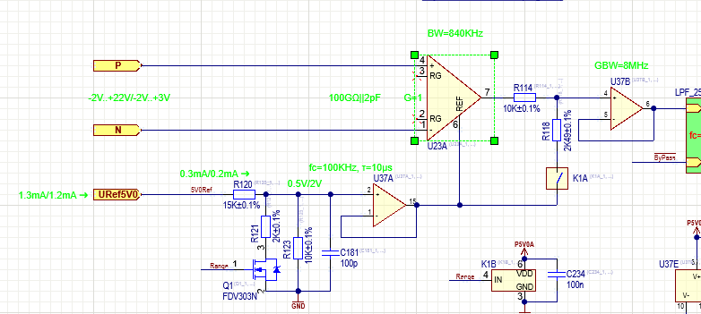

# Processor : [RP20400](https://datasheets.raspberrypi.com/rp2040/rp2040-datasheet.pdf)

- [DigiKey](https://www.digikey.de/en/products/detail/raspberry-pi/SC0914-13/14306010?s=N4IgTCBcDaIEoAUwAYAsyQF0C%2BQ) @ 0.65€
- [Mouser](https://www.mouser.de/ProductDetail/Raspberry-Pi/SC091413?qs=T%252BzbugeAwjhr%252BUbBr3TJcw%3D%3D) @ 0.66€

# DC/DC

- -5V -> [CRE1S0505SC](CRE1.pdf) [Digikey](https://www.digikey.de/en/products/detail/murata-power-solutions-inc/CRE1S0505SC/6056052?s=N4IgTCBcDaIMICUCiBGAygBgKzbXEAugL5A) @ 2.19€
- +15V -> [CRE1S0515SC](CRE1.pdf) [Digikey](https://www.digikey.de/en/products/detail/murata-power-solutions-inc/CRE1S0515SC/6056053?s=N4IgTCBcDaIMICUCiBGAygBgKwq2uIAugL5A) @ 2.75€

# CONN RCPT USB2.0 MINI A SMD R/A

- [TE 1734327-1](https://www.te.com/usa-en/product-1734327-1.html) @ [DigiKey](https://www.digikey.de/en/products/detail/te-connectivity-amp-connectors/1734327-1/1891548) for 1.16€

# IC VREF SHUNT 0.1% SOT23-3

- [Ti LM4040 0.1% SOT23](https://www.ti.com/product/LM4040-N-Q1?utm_source=google&utm_medium=cpc&utm_campaign=ti-null-null-xref-cpc-pf-google-wwe&utm_content=xref&ds_k=%7B_dssearchterm%7D&DCM=yes&gad_source=1&gclid=CjwKCAiAi6uvBhADEiwAWiyRdunzXcytIhK3ImdtycHi549Wq5yjzckCAhmtx2b9TmPcik8dL8xs8RoC3vMQAvD_BwE&gclsrc=aw.ds) @ [DigiKey](https://www.digikey.de/en/products/detail/texas-instruments/LM4040AIM3X-3-0-NOPB/1871449) for 1.78€

# IC FLASH 16MBIT SPI/QUAD 8USON

- W25Q16JVUXIQ TR @ [DigiKey](https://www.digikey.de/en/products/detail/winbond-electronics/W25Q16JVUXIQ-TR/15182017?s=N4IgTCBcDaIOpgKwEUCMA2AUgNQKoA0BJZEAXQF8g) for 0.54€

# IC REG BCK-BST 3.3V 800MA 10WDFN

- RT6150B-33GQW @ [DigiKey](https://www.digikey.de/en/products/detail/richtek-usa-inc/RT6150B-33GQW/6676709?s=N4IgTCBcDaIEoBUBsBGArABgEIFoDMeA4gIoDqIAugL5A) for 1.80€

# DIODE SCHOTTKY 20V 1A SOD123FL

- MBR120VLSFT1G @ [DigiKey]()

AD8065
AD8221 @ [DigiKey](https://www.digikey.co.uk/en/products/detail/analog-devices-inc/AD8221ARMZ-R7/996058?s=N4IgTCBcDaIIIBEAcYwEY4CUCyAtAtJgOwIDSm%2BAcgiALoC%2BQA)

